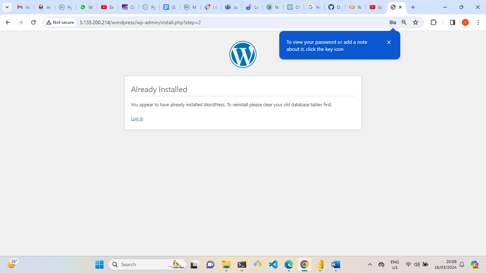

# IMPLEMENTING -WORDPRESS-LVM-MANAGEMENT

## Implementing WordPress Website And LVM (Logical Volume Management) Storage Management.

## Introduction
#### In this project we will work on the implementation of a WordPress website with a storage management. Here we will be using Logical Volume Management (LVM).

#### Logical Volume Management (LVM) provides a flexible approach to manage storage in Linux systems while WordPress is a widely-used content management system.

#### While combining WP and LVM technology it provides better scalability, resilience, and ease of maintenance.

### **What is LVM storage?**
### LVM, or Logical Volume Management, is a storage device management technology that gives users the power to pool and abstract the physical layout of component storage devices for flexible administration.

### Importance of LVM

### 1 Abstraction and Flexibility  LVM abstracts away the complexities of raw disk partitions. Instead of dealing with fixed partitions, you work with logical volumes.
#### Logical volumes can be dynamically resized, allowing you to adapt to changing storage needs without the hassle of repartitioning.
#### Imagine having a central storage pool where you can easily allocate or reclaim space as required. LVM makes this possible.

### 2 Components of LVM Physical Volumes (PV): These are the actual physical disks or  partitions that contribute storage space to the LVM pool.
#### Volume Groups (VG): VGs are created by combining one or more PVs. They serve as the central storage pool.
#### Logical Volumes (LV): LVs are logical partitions within VGs. You can mount them just like regular disk partitions.

### 3 Ease of Resizing
#### The nightmare of resizing partitions is a thing of the past with LVM.

#### Need more space for a specific logical volume?Simply extend it within the VG.

#### Shrinking a volume? LVM handles that too, without data loss.

### 4 Meaningful Names:   Unlike cryptic partition names (like /dev/sda1), LVM allows you to assign meaningful names to logical volumes.
#### For instance, you can have an LV named “databases” or “root-backup.”

### Target Audience
#### DevOps engineers
#### system administrators
#### Incoming Devop Engineers
#### Software Engineer

### Prerequisites
### •	Basic knowledge of Linux systems.
### •	Understanding of Ec2 cloud server
### •	 Understanding of WordPress.
### •	Basic understanding of Mysql.
### •	Understanding of client server.

### Goal
#### At the end of this project, learner should be able to create volume, extend volume and manage logical volume.
#### Learner should also know the process of setting client server and Database server
#### Learner should understand streps involving in setting up wordpress website.
#### Implementing Wordpress Web Solution

### Understanding 3-Tier Achitecture
#### 3 tier achitecture is a client server software achitecture pattern that comprises of 3 seperate layers 

#### These Layers are 
#### 1 Presentation layer
#### 2 Business layer
#### Data acess or management layer

### Your 3-Tier Setup
#### •	A Laptop or PC to serve as a client 
#### •	An EC2 Linux Server as a web server (This is where you will install WordPress)
#### •	An EC2 Linux server as a database (DB) serve

### 1.Create 2 AWS instance using RedHat 

### One EC2 instance will serve as a Web Server.

### While second EC2 instance will serve as database server.

### Create 3 volumes as the Web Server EC2, of 10GB each.

### Create  another 3 volumes as the database Server EC2, of 10GB each.

### Attach the three volumes created one by one  to your Webserver EC2 instance

### Attach the three volumes created one by one  to your Data base server EC2 instance

### Open up the Linux terminal to begin configuration

### Use lsblk command to inspect what block devices are attached to the server. Newly created devices will have a new name.
### They all comes with new name xvdf, xvdh, xvdg.

	

### Use df -h command to see all mounts and free space on your server

### Use gdisk utility to create a single partition on each of the 3 disks
### `sudo gdisk /dev/xvdf`

### `sudo gdisk /dev/xvdg`

### `sudo gdisk /dev/xvdh`

### Use lsblk utility to view the newly configured partition on each of the 3 disks.

### Install lvm2 package using sudo yum install lvm2. 
### Run below command
### `sudo lvmdiskscan` command to check for available partitions.

### Use pvcreate utility to mark each of 3 disks as physical volumes (PVs) to be used by LVM.

### Use vgcreate utility to add all 3 PVs to a volume group (VG). Name the VG webdata-vg

### `sudo vgcreate webdata-vg /dev/xvdh1 /dev/xvdg1 /dev/xvdf1`

### Verify that VG has been created

### Use lvcreate utility to create 2 logical volumes. apps-lv (Use half of the PV size), and logs-lv Use the remaining space of the PV size. NOTE: apps-lv will be used to store data for the Website while, logs-lv will be used to store data for logs.

### Use below code 
### `sudo lvcreate -n apps-lv -L 14G webdata-vg`
### `sudo lvcreate -n logs-lv -L 14G webdata-vg`

### Verify that your Logical Volume has been created successfully.
###  Run sudo lvs

### Verify the entire setup
### use below code 
### `sudo vgdisplay -v #view complete setup - VG, PV, and LV`

### `sudo lsblk` 

### Use mkfs.ext4 to format the logical volumes with ext4 filesystem
### Input below code
### `sudo mkfs -t ext4 /dev/webdata-vg/apps-lv`
### `sudo mkfs -t ext4 /dev/webdata-vg/logs-lv`

### 15 Create /var/www/html directory to store website files
### Use below code 
### `sudo mkdir -p /var/www/html`

### Create /home/recovery/logs to store backup of log data
### Use below code
### `sudo mkdir -p /home/recovery/logs`

### Mount /var/www/html on apps-lv logical volume
### Enter this code 
### `Sudo mount /dev/webdata-vg/apps-lv /var/www/html`.

###	Use rsync utility to backup all the files in the log directory /var/log into /home/recovery/logs (This is required before mounting the file system)

### `sudo rsync -av /var/log/. /home/recovery/logs`

### Mount /var/log on logs-lv logical volume. (Note that all the existing data on /var/log will be deleted. That is why step 15 above is very important) 
### `sudo mount /dev/webdata-vg/logs-lv /var/log`

### Restore log files back into /var/log directory
### Use below code
### `sudo rsync -av /home/recovery/logs/. /var/log`

### Update /etc/fstab file so that the mount configuration will persist after restart of the server

### Update the /etc/fstab file
### We will make use of the UUID of the device to update our /etc/fstab file;
### Input below code to get UUID code
###     `sudo blkid`

### Then enter below code
### `sudo vi /etc/fstab`

### Update /etc/fstab using our UUID and we will remove {type =4}.
### Test the configuration and reload the daemon with below code

### `sudo mount -a`

### systemctl daemon-reload`

### Verify your setup by running df -h, output must look like this:
### `df -h`

## We have to Prepare the Database Server

### Launch our second EC2 instance (Data base) that will have a role – ‘DB Server’.

### Then the same steps as we did for the Web Server, connect with ssh  

### but we will create db-lv and not apps-lv

### Create  another 3 volumes as the database Server EC2, of 10GB each.

### Attached 3 volume created on database server.

### Use lsblk command to inspect what block devices are attached to the server

### All devices in Linux reside in /dev/ directory. 
### Check with ls /dev/ and make sure you see all 3 newly created block devices are available.

### Use df -h command to see all mounts and free space on your server

### Use gdisk utility to create a single partition on each of the 3 disks
### sudo gdisk /dev/xvdf

### Use lsblk utility to view the newly configured partition on each of the 3 disks.

### Install lvm2 package using sudo yum install lvm2. Run sudo lvmdiskscan command to check for available partitions.

### Use pvcreate utility to mark each of 3 disks as physical volumes (PVs) to be used by LVM.

### `sudo pvcreate /dev/xvdf1`
### `sudo pvcreate /dev/xvdg1`
### `sudo pvcreate /dev/xvdh1`

### `Sudo PVS`

### 12.	Use vgcreate utility to add all 3 PVs to a volume group (VG). Name the VG webdata-vg.

### `sudo vgcreate webdata-vg /dev/xvdh1 /dev/xvdg1 /dev/xvdf1`

### Verify that VG has been created.
### Use lvcreate utility to create 2 logical volumes. apps-lv (Use half of the PV size), and logs-lv Use the remaining space of the PV size.
### NOTE: apps-lv will be used to store data for the Website while, logs-lv will be used to store data for logs.

### sudo lvcreate -n apps-lv -L 14G webdata-vg
### sudo lvcreate -n logs-lv -L 14G webdata-vg

### Verify that your Logical Volume has been created successfully by running sudo lvs
### Verify the entire setup
### Use mkfs.ext4 to format the logical volumes with ext4 filesystem
### Input below code
### `sudo mkfs -t ext4 /dev/webdata-vg/apps-lv
### `sudo mkfs -t ext4 /dev/webdata-vg/logs-lv

### Then mount it to var/www/db directory not on /var/www/html/.
### `sudo mkdir -p /var/www/html`

### Mount /var/www/html on apps-lv logical volume
### `Sudo mount /dev/webdata-vg/apps-lv /var/www/html`

### Use rsync utility to backup all the files in the log directory /var/log into /home/recovery/logs (This is required before mounting the file system).
### `sudo rsync -av /var/log/. /home/recovery/logs`

### Mount /var/log on logs-lv logical volume. (Note that all the existing data on /var/log will be deleted. That is why step 15 above is very important)

### sudo mount /dev/webdata-vg/logs-lv /var/log

### Restore log files back into /var/log directory

### `sudo rsync -av /home/recovery/logs/. /var/log`

### Update /etc/fstab file so that the mount configuration will persist after restart of the server
### Update the /etc/fstab file

### We will make use of the UUID of the device to update our /etc/fstab file;

### Input below code to get 	UUID code

### `sudo blkid`

### Then enter below code
### `sudo vi /etc/fstab`

### Update /etc/fstab using our UUID and we will remove {type =4}.

### Test the configuration and reload the daemon with below code

### sudo mount -a

### `systemctl daemon-reload`

### Install WordPress On a Web Server

### Update the repository

### `sudo yum -y update`

### Install wget, Apache and it’s dependencies.

### `sudo yum -y install wget httpd php php-mysqlnd php-fpm php-json`

### `Start Apache`
### `sudo systemctl enable httpd`

### `sudo systemctl start httpd`

### To install PHP and its dependencies

### `sudo yum install https://dl.fedoraproject.org/pub/epel/epel-release-latest-8.noarch.rpm`

### `sudo yum install yum-utils http://rpms.remirepo.net/enterprise/remi-release-8.rpm`

### `sudo yum module list php`

### `sudo yum module reset php`

### `sudo yum module enable php:remi-7.4`

### `sudo yum install php php-opcache php-gd`

### `php-curl php-mysqlnd`

### `sudo systemctl start php-fpm`

### `sudo systemctl enable php-fpm`

### `setsebool -P httpd_execmem 1`

### Restart Apache

### `sudo systemctl restart httpd`

### Test Apache is working

### Download and install Wordpress and Copy Wordpress to var/www/html

### mkdir wordpress
### Change directory to wordpress
### `cd wordpress`
### `sudo wget http://wordpress.org/latest.tar.gz`
### `sudo tar xzvf latest.tar.gz`
### `sudo rm -rf latest.tar.gz`
### `cp wordpress/wp-config-sample.php wordpress/wp-config.php`
### `cp -R wordpress /var/www/html/`

### Configure SELinux Policies

### `sudo chown -R apache:apache /var/www/html/wordpress`
### `sudo chcon -t httpd_sys_rw_content_t /var/www/html/wordpress -R`
### sudo setsebool -P httpd_can_network_connect=1`

### Install MySQL On EC2 DB Server

### `sudo yum update`
### `sudo yum install mysql-server -y`

### Verify that the service is running 
### Enter 
###  `sudo systemctl status mysqld`

### Then restart mysql with sudo systemctl restart mysqld

### Then enable mysql service with sudo systemctl enable mysqld
### `sudo systemctl restart mysqld`
### `sudo systemctl enable mysqld`

### Configure DataBase To Work With WordPress (on database server)

### `sudo mysql`

### CREATE DATABASE wordpress;

### CREATE USER `myuser`@`<Web-Server-Private-IP-Address>` `IDENTIFIED BY 'mypass';

### GRANT ALL ON wordpress.* TO 'myuser'@'<Web-Server-Private-IP-Address>';

### `FLUSH PRIVILEGES;`

### `SHOW DATABASES;`

### Configure WordPress To Connect To Remote Database

### Go to security group on database server,

### Edit inbound rule, select Mysql/Aurora and open port 3306 on database server.

### Source info should be Webserver private IP address/32.
### 172-31-7-206/32

### Then save inbound rule.

### Install MySQL client on web server and test that you can connect from your Web Server to your DB server by using mysql-client

### Use below code.
### `yum install mysql`

### `# mysql -u admin -p -h` <DB-Server-Private-IP-address>
### login into mysql on webserver with login detail created on DB server
### User name and password created must be used.

### Verify if you can successfully execute SHOW DATABASES; command 

### Check the list of created database.

### Edit apache by change the permissions and configuration so that Apache could use WordPress:

### Open security group and enable TCP port 80 in Inbound Rules configuration for our Web Server.

### Enable from everywhere 0.0.0.0/0  from my work station.

### Before we get started, we need to get some information on Data base. We need to know the following items before proceeding.

### ('DB_NAME', 'wordpress');
### ('DB_USER', 'myuser');
### ('DB_PASSWORD', 'mypass');
### ('DB_HOST', `172.31.46.44');
### (‘DB_PREFIX); if we need to run more than one wordpress in a single database.

### `vi /var/www/html/wordpress/wp-config.php`

### We can now try  to access WordPress from our browser the link to your WordPress by using below link.

### `http://<Web-Server-Public-IP-Address>/wordpress/`
### `http://172-31-7-206/wordpress/`

### Word press can now easily communicate with our database.

### We have learned how to configure Linux storage subsystem and have also deployed a full scale Web solution using WordPress CMS and MYSQL RDBMS.

